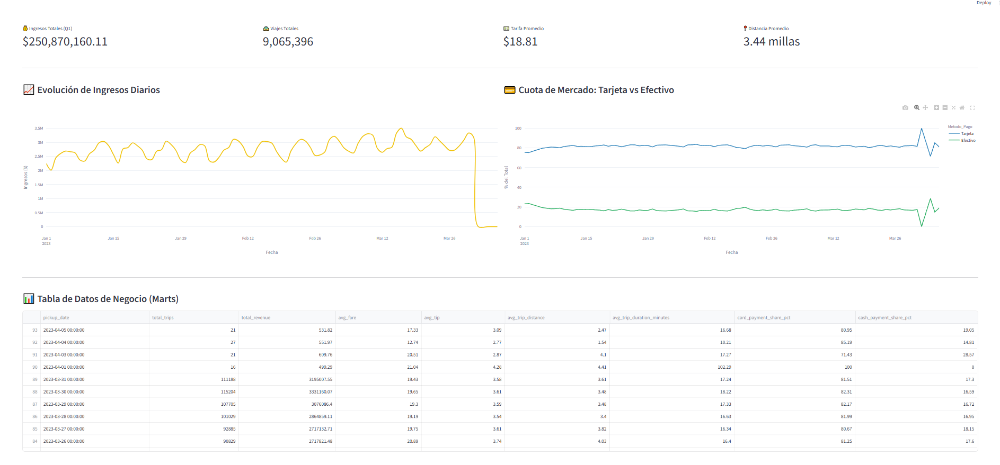

# 🚕 NYC Mobility Lakehouse: End-to-End Modern Data Stack

Este proyecto implementa una plataforma de datos (**Data Lakehouse**) de nivel empresarial utilizando una **Arquitectura Medallion** para procesar, limpiar y analizar más de 9 millones de registros de viajes de los taxis amarillos de Nueva York (NYC TLC). 

El objetivo es construir un pipeline automatizado, robusto y escalable capaz de aislar anomalías físicas de los datos y transformarlas en KPIs financieros listos para la toma de decisiones.

## 🏗️ Arquitectura del Sistema (Medallion)

El flujo de datos sigue un desacoplamiento estricto de cómputo y almacenamiento:

1. **Landing Zone**: Ingesta de archivos Parquet crudos desde el repositorio oficial mediante Python.
2. **Capa Bronze (Ingesta)**: Esquema abierto gestionado por **PySpark** para consolidar los datos históricos garantizando tipos de datos consistentes.
3. **Capa Silver (Limpieza)**: Procesamiento distribuido con PySpark para calcular duraciones de viaje, formatear fechas y aplicar un *Data Quality Filter* que aísla un **3.4% de viajes anómalos** (coordenadas erróneas, fallos de taxímetro). Almacenamiento en formato **Delta Lake** con transacciones ACID.
4. **Capa Gold (Marts de Negocio)**: Modelado de datos analítico utilizando **dbt Core** y **DuckDB** ejecutándose directamente sobre los archivos Delta.
5. **Orquestación**: Todo el flujo está enlazado, monitorizado y programado mediante **Apache Airflow**.
6. **Visualización**: Dashboard interactivo construido en **Streamlit** y **Plotly** consumiendo los Data Marts de DuckDB en milisegundos.

## 🛠️ Tecnologías Utilizadas

* **Lenguaje:** Python 3.12
* **Músculo de Cómputo:** Apache Spark (PySpark 3.5)
* **Formato de Almacenamiento:** Delta Lake (ACID, Time Travel, Particionado)
* **Motor Analítico e In-Memory:** DuckDB
* **Transformación y Calidad:** dbt Core (Data Build Tool)
* **Orquestador:** Apache Airflow 3.x
* **Visualización:** Streamlit + Plotly

---

## Airflow Pipeline



---

## Streamlit Dashboard


---

## 📂 Estructura del Proyecto

```text
nyc-mobility-lakehouse/
├── airflow/               # Configuración de Orquestación
│   └── dags/
│       └── nyc_taxi_lakehouse_dag.py
├── data/                  # Almacenamiento local (Ignorado en Git)
│   ├── bronze/
│   ├── silver/
│   └── gold/
├── dbt/                   # Proyecto de Analytics Engineering
│   ├── models/
│   │   ├── staging/       # Vistas de dbt apuntando a Delta Lake
│   │   └── marts/         # Tablas Gold agregadas con tests de calidad
│   ├── dbt_project.yml
│   └── profiles.yml
├── src/                   # Scripts del Core Pipeline
│   ├── app.py             # Aplicación de Streamlit
│   ├── bronze_ingestion.py
│   ├── download_data.py
│   └── silver_transformations.py
└── .gitignore

